=========================
Benutzerhandbuch ELISA-AI
=========================

Dieses Handbuch erklärt, wie Studierende und Lehrende die ELISA-Oberflächen im
OpenBook-Prototyp bedienen. Es beschreibt bewusst nur sichtbare Nutzerabläufe:
Dashboard, Kurs-Chat, Kursinhalte, Quiz, Exam, Spiele und Teacher-Frontend.

.. contents:: Page Content
   :local:

--------------------
Einstieg Und Rollen
--------------------

ELISA wird über OpenBook geöffnet. Nach der Anmeldung leitet das System Lehrende in
das Teacher-Frontend und Studierende in das Dashboard. Wenn die automatische
Weiterleitung nicht greift, können die Oberflächen direkt geöffnet werden.

Zur Navigationshilfe enthält dieses Handbuch Direktlinks zu den einzelnen ELISA-Seiten.
Die Links funktionieren, wenn OpenBook lokal läuft und der Benutzer angemeldet ist.

.. list-table:: Einstiege In Die ELISA-Oberflächen
   :header-rows: 1
   :widths: 25 35 40

   * - Rolle
     - Adresse
     - Zweck
   * - Studierende
     - ``/dashboard/index.html``
     - Kurse öffnen, Inhalte lesen, Chat, Quiz, Exam und Spiele nutzen.
   * - Lehrende
     - ``/teacher/``
     - Kurse vorbereiten, Inhalte pflegen und Studierende einschreiben.

Lehrende müssen Mitglied der Django-Gruppe ``Teacher`` sein. Ohne diese Rolle wird das
Teacher-Frontend nicht geöffnet. Studierende benötigen eine Kurseinschreibung, damit
Kurse im Dashboard erscheinen.

Die OpenBook-Administration ist nicht Teil dieses Benutzerhandbuchs. Sie bleibt für
Benutzer, Rollen und technische Verwaltung zuständig. Für die normale ELISA-Nutzung
reichen Dashboard und Teacher-Frontend aus.

-------------------------
Anleitung Für Studierende
-------------------------

Studierende arbeiten im Dashboard. Dort stehen Kursübersicht, Lernfortschritt,
Punkte, Skills, Bestenliste und die Navigation in die Kursfunktionen bereit. Der
normale Ablauf ist: Kurs öffnen, Inhalte lesen, Fragen stellen, Quiz oder Exam
bearbeiten und den Fortschritt prüfen.

Dashboard Öffnen
................

1. Melden Sie sich in OpenBook an.
2. Öffnen Sie das Dashboard über die Weiterleitung oder über
   ``/dashboard/index.html``.
3. Wählen Sie in der Kursübersicht den gewünschten Kurs aus.

Direktlink: `Dashboard öffnen`_.

Wenn kein Kurs sichtbar ist, ist der Account wahrscheinlich noch nicht eingeschrieben
oder es fehlen Kursdaten. In diesem Fall muss eine Lehrperson den Kurs vorbereiten und
den Account im Teacher-Frontend einschreiben.

Dashboard Verstehen
...................

Das Dashboard zeigt mehrere Bereiche. ``MyLearningPanel`` listet Kurse und nächste
Lernschritte. ``StatsPanel`` zeigt Punkte, Level und Streak. ``LeaderboardPanel`` zeigt
die Bestenliste. ``SkillMatrixPanel`` zeigt den Skill-Fortschritt.

Diese Werte sind Lernhinweise. Sie zeigen Aktivität und Fortschritt, ersetzen aber
keine fachliche Rückmeldung durch eine Lehrperson. Punkte, Level und Streaks sollen
zum regelmäßigen Üben motivieren.

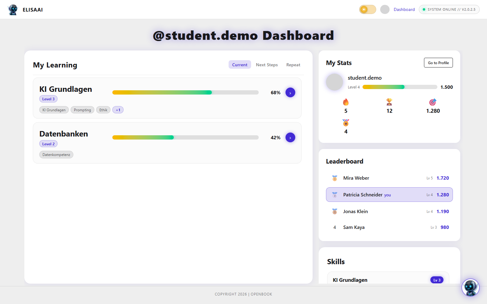

   Beispielansicht: Das Dashboard zeigt Kurse, Lernfortschritt, Punkte,
   Bestenliste und Skills.

Kursinhalte Lesen
.................

Öffnen Sie einen Kurs und wählen Sie in der Kursnavigation ``Skript``. Links erscheint
die Seitenliste, rechts der Inhalt der ausgewählten Seite. Mit ``Previous`` und
``Next`` wechseln Sie durch die Seiten.

Direktlink: `Kursinhalt öffnen`_.

Beim Öffnen einer Seite speichert ELISA die letzte Position. Mit ``Mark complete``
markieren Sie eine Seite als bearbeitet. Am Ende kann ``Complete course`` den ganzen
Kurs abschließen, wenn die Funktion in der Umgebung verfügbar ist.

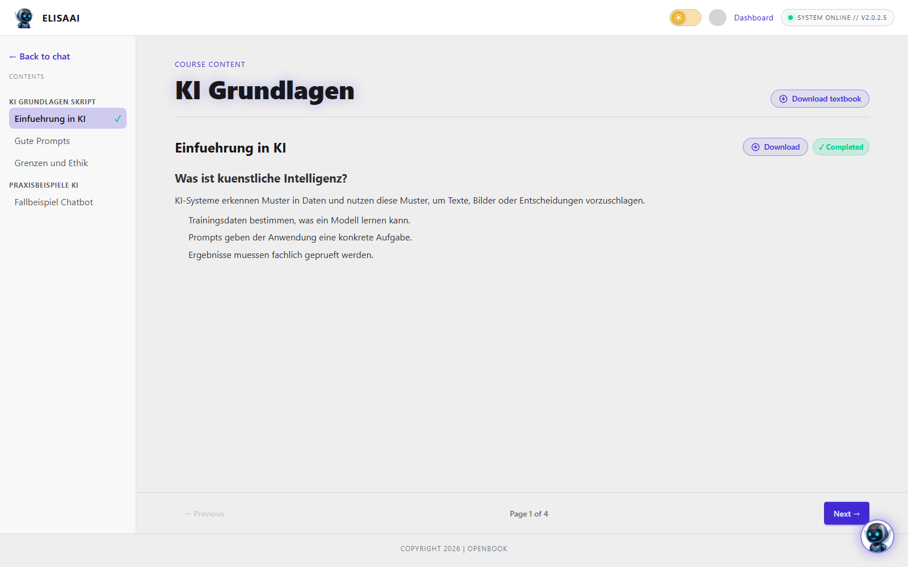

   Beispielansicht: Im Skriptbereich wählen Studierende links eine Seite und lesen
   rechts den Inhalt.

Fragen An ELISA Stellen
.......................

Der Kurs-Chat beantwortet Fragen zum geöffneten Kurs. Geben Sie Ihre Frage in das
Eingabefeld ein und senden Sie sie ab. Der Chat benötigt eine aktive
WebSocket-Verbindung; die Oberfläche zeigt den Verbindungsstatus an.

Direktlink: `Kurs-Chat öffnen`_.

Gespeicherte Chats erscheinen in der Seitenleiste. Sie können einen neuen Chat starten,
ältere Chats öffnen, umbenennen oder löschen. So lassen sich unterschiedliche
Lernsituationen pro Kurs getrennt halten.

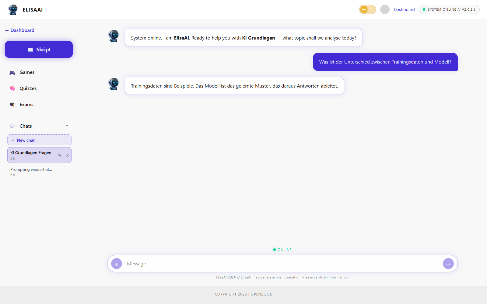

   Beispielansicht: Im Kurs-Chat sehen Studierende gespeicherte Chats, Navigation
   zu Skript, Quiz, Exam und Games sowie den aktuellen Chatverlauf.

Quiz Bearbeiten
...............

1. Öffnen Sie im Kurs den Bereich ``Quizzes``.
2. Wählen Sie ein Textbook aus.
3. Warten Sie, bis ELISA die Fragen erzeugt hat.
4. Beantworten Sie die Multiple-Choice-Fragen.
5. Prüfen Sie Ergebnis, Punkte und Skill-Fortschritt.

Direktlink: `Quiz öffnen`_.

Ein erneuter Versuch bringt nur dann neue Punkte, wenn das Ergebnis besser ist als das
bisher belohnte Ergebnis. Diese Regel verhindert, dass Punkte durch bloßes Wiederholen
gesammelt werden.

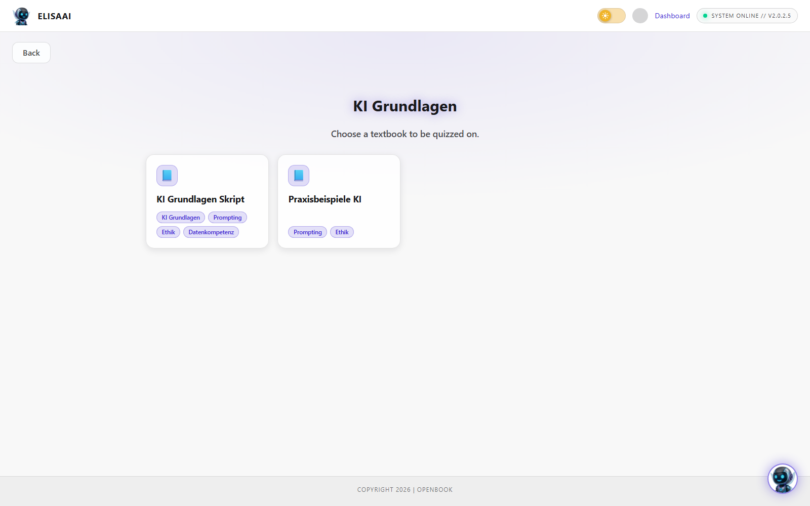

   Beispielansicht: Vor einem Quiz wählen Studierende das Textbook aus, aus dem
   ELISA Fragen erzeugt.

Exam Nutzen
...........

Der Bereich ``Exams`` erzeugt prüfungsähnliche Übungen aus einem ausgewählten Textbook.
Die Aufgaben können Multiple-Choice- und Freitextfragen enthalten. Nach der Abgabe
zeigt ELISA Punkte, Feedback und gespeicherte Exam-Versuche.

Direktlink: `Exam öffnen`_.

Nutzen Sie Exams als Übung und Orientierung. KI-generiertes Feedback kann hilfreich
sein, sollte aber bei wichtigen fachlichen Fragen mit dem Skript oder der Lehrperson
abgeglichen werden.

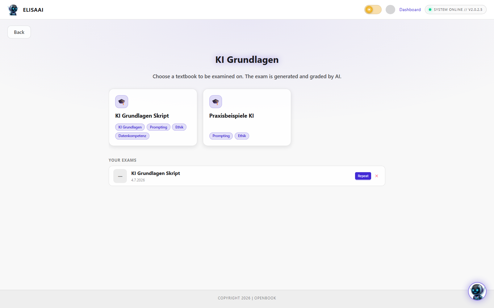

   Beispielansicht: Exams starten ebenfalls mit einer Textbook-Auswahl und zeigen
   gespeicherte Versuche.

Spiele Nutzen
.............

Der Bereich ``Games`` bietet Memory, Flashcards und Hangman. Die Spiele verwenden nach
Möglichkeit Begriffe und Abschnitte aus den Kursinhalten. Wenn ein Kurs noch keine
auswertbaren Inhalte enthält, können neutrale Inhalte oder leere Zustände erscheinen.

Direktlink: `Games öffnen`_.

Memory nutzt kurze Begriffe aus dem Kurs und lässt passende Kartenpaare finden.
Flashcards erzeugt Lernkarten aus Überschriften und Abschnitten. Hangman nutzt
Fachbegriffe aus Kursseiten.

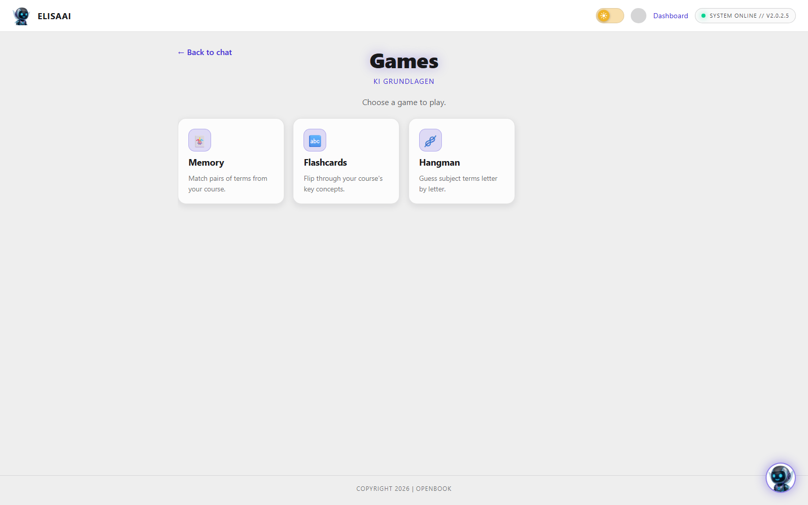

   Beispielansicht: Die Games-Übersicht bietet Memory, Flashcards und Hangman für
   den geöffneten Kurs.

**Memory** --- Memory öffnet ein Kartenfeld mit Begriffen aus dem Kurs. Decken Sie
zwei Karten nacheinander auf. Wenn beide Karten zusammenpassen, bleiben sie sichtbar.
Die Anzeige zeigt Züge, gefundene Paare und die benötigte Zeit.

Direktlink: `Memory öffnen`_.

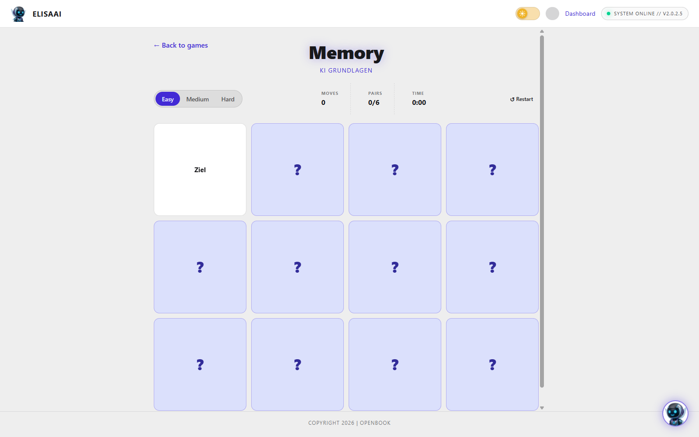

   Beispielansicht: Memory zeigt verdeckte Karten, Schwierigkeitsstufen und einen
   aufgedeckten Kursbegriff.

**Flashcards** --- Flashcards erzeugt Lernkarten aus Kursabschnitten. Auf der Vorderseite
steht ein Begriff oder eine Überschrift. Nach dem Umdrehen erscheint die Erklärung aus
dem Skript. Mit ``Prev``, ``Next`` und ``Shuffle`` wechseln oder mischen Sie die Karten.

Direktlink: `Flashcards öffnen`_.

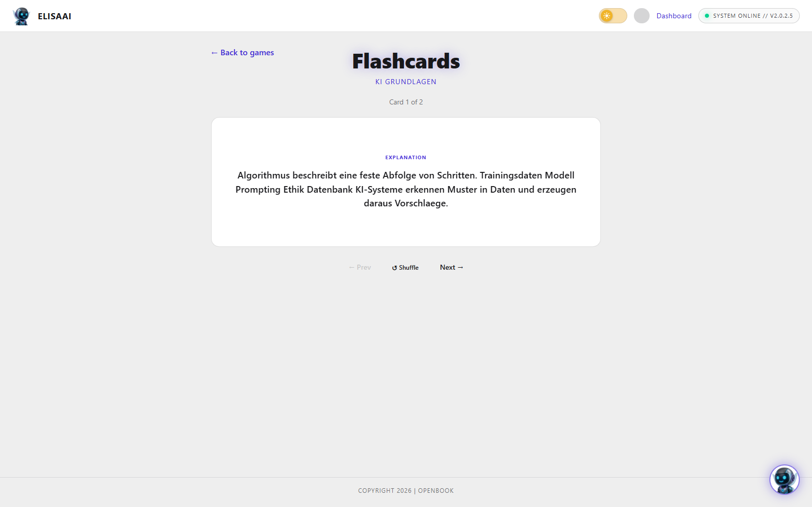

   Beispielansicht: Eine umgedrehte Flashcard zeigt die Erklärung zur aktuellen
   Lernkarte.

**Hangman** --- Hangman wählt einen Fachbegriff aus den Kursinhalten. Raten Sie die
Buchstaben über die Tastatur oder über die Buttons auf dem Bildschirm. Falsche
Buchstaben füllen die Fehleranzeige; richtige Buchstaben werden im Begriff sichtbar.

Direktlink: `Hangman öffnen`_.

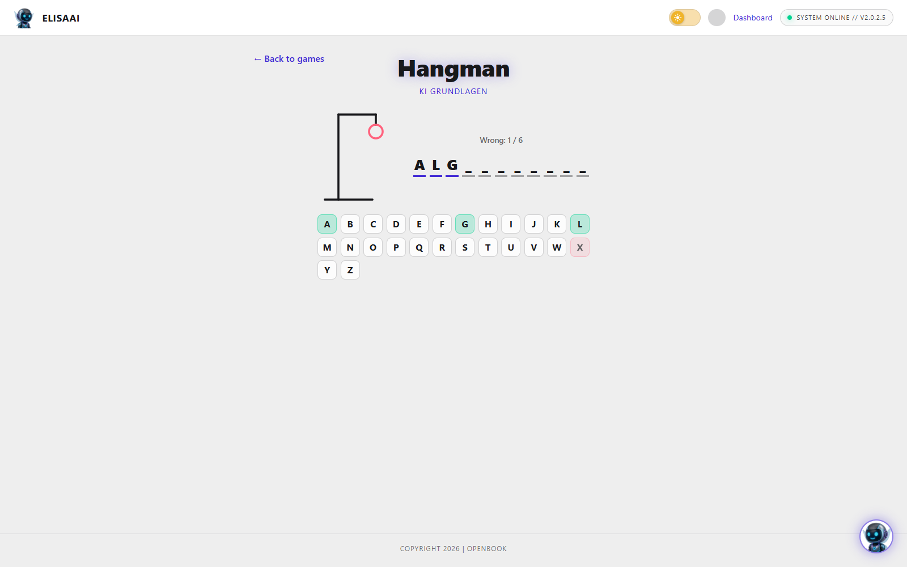

   Beispielansicht: Hangman zeigt geratene Buchstaben, Fehlerstand und die
   Bildschirmtastatur.

----------------------
Anleitung Für Lehrende
----------------------

Lehrende arbeiten im Teacher-Frontend. Dort werden Kurse erstellt, Materialien
hochgeladen, Textbooks und Seiten gepflegt, Skills vergeben und Studierende
eingeschrieben. Die Oberfläche ist dafür gedacht, typische Kursarbeit ohne direkten
Django-Admin-Zugriff zu erledigen.

Teacher-Frontend Öffnen
.......................

1. Melden Sie sich mit einem Account an, der zur Gruppe ``Teacher`` gehört.
2. Öffnen Sie ``/teacher/``.
3. Prüfen Sie auf der Startseite ``My Courses``, ob Ihre Kurse sichtbar sind.

Direktlink: `Teacher-Kursübersicht öffnen`_.

Jede Kurskarte zeigt grundlegende Informationen und führt über ``Manage`` in die
Kursdetailseite. Dort stehen die Tabs ``Overview``, ``Students`` und ``Content`` zur
Verfügung.

Über ``Delete`` löschen Lehrende einen Kurs nach einer Sicherheitsabfrage. Nutzen Sie
diese Aktion nur, wenn der Kurs nicht mehr für Studierende benötigt wird.

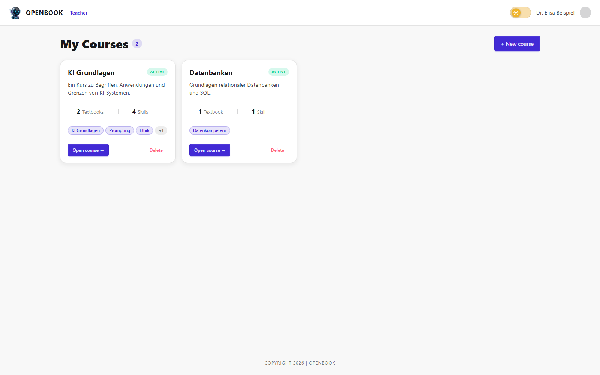

   Beispielansicht: Lehrende sehen ihre Kurse als Karten und öffnen die
   Kursverwaltung über ``Open course``.

Kurs Anlegen
............

1. Klicken Sie auf ``New course``.
2. Tragen Sie den Kursnamen ein.
3. Wählen Sie eine vorhandene ``Library Group`` oder legen Sie eine neue an.
4. Öffnen Sie bei Bedarf ``Advanced settings`` für Slug, Beschreibung und weitere
   OpenBook-Felder.
5. Speichern Sie den Kurs.

Für die normale Arbeit reichen Kursname und Library Group aus. Die erweiterten Felder
sind vor allem relevant, wenn ein Kurs gezielt mit bestehenden OpenBook-Strukturen
verbunden werden soll.

Kursdetails Bearbeiten
......................

Im Tab ``Overview`` bearbeiten Sie Kursname, Beschreibung und weitere Kursdaten. Diese
Daten helfen Studierenden, den Kurs im Dashboard zu erkennen. Speichern Sie Änderungen,
bevor Sie in einen anderen Bereich wechseln.

Wenn ein Kurs keine Library Group hat, können Inhalte und Uploads fehlschlagen. Prüfen
Sie deshalb zuerst ``Overview``, wenn im Content-Bereich Fehlermeldungen erscheinen.

Studierende Einschreiben
........................

Öffnen Sie den Tab ``Students``. Dort suchen Sie nach Benutzern und schreiben sie in den
Kurs ein. Beim Einschreiben wird die Student-Rolle im Kurskontext verwendet.

Eingeschriebene Studierende erscheinen danach im Dashboard. Wenn ein Kurs dort nicht
angezeigt wird, prüfen Sie die Einschreibung und ob der Account mit dem richtigen
Benutzer angemeldet ist.

Über ``Remove`` entfernen Lehrende eingeschriebene Studierende wieder aus dem Kurs. Die
Studierenden sehen den Kurs danach nicht mehr in ihrer Kursübersicht.

Materialien Hochladen
.....................

Öffnen Sie den Tab ``Content``. Über ``Upload a script`` laden Sie ein Skript hoch. Das
Backend akzeptiert ``.md``, ``.markdown``, ``.html``, ``.htm``, ``.txt`` und ``.pdf``.

Beim Upload versucht ELISA, Kapitel zu erkennen und daraus Textbook-Seiten anzulegen.
Öffnen Sie das erzeugte Textbook danach und prüfen Sie die Seiten. PDF- und
Markdown-Importe können Nacharbeit brauchen, vor allem bei Überschriften,
Seitenreihenfolge und Formatierung.

Textbooks Und Seiten Pflegen
............................

Im Content-Bereich können Sie ein neues Textbook anlegen oder ein vorhandenes Textbook
anhängen. Ein Klick auf ein Textbook öffnet den Editor. Links steht die Seitenliste,
rechts werden Titel, Format, Inhalt, Vorschau und Skills der ausgewählten Seite
bearbeitet.

Mit ``New page`` legen Sie neue Seiten an. Mit ``Import file`` füllen Sie eine Seite aus
einer ``.md``, ``.html`` oder ``.txt``-Datei. Mit ``Write`` bearbeiten Sie den Inhalt,
mit ``Preview`` prüfen Sie die Darstellung, und mit ``Save page`` speichern Sie die
Seite.

Direktlink: `Teacher-Content-Editor öffnen`_.

Mit ``Rename`` benennen Sie ein Textbook um. Mit ``Remove`` entfernen Sie ein Textbook
aus dem Kurs. Das kleine Löschsymbol neben einer Seite löscht die jeweilige Seite nach
einer Sicherheitsabfrage.

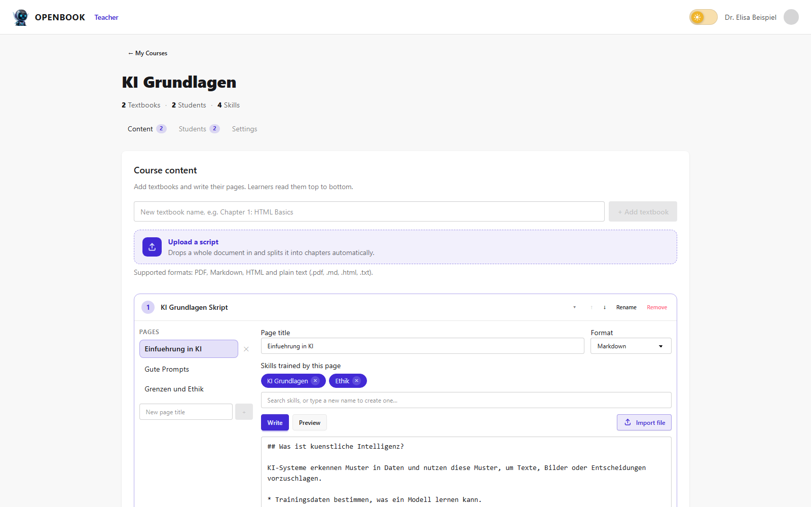

   Beispielansicht: Im Content-Editor pflegen Lehrende Textbook-Seiten, Inhalte
   und Skills.

Skills Vergeben
...............

Skills werden pro Textbook-Seite vergeben. Suchen Sie im Skill-Feld nach vorhandenen
Skills oder legen Sie direkt einen neuen Skill an. Die vergebenen Skills bestimmen,
welcher Skill-Fortschritt bei Quiz- und Exam-Ergebnissen sichtbar werden kann.

Vergeben Sie Skills sparsam und fachlich passend. Ein Skill sollte eine Kompetenz oder
ein Thema beschreiben, das auf der Seite tatsächlich trainiert wird.

Kurs Für Studierende Prüfen
...........................

Prüfen Sie nach dem Bearbeiten eines Kurses die Studierendensicht. Ein sinnvoller
Kontrollablauf ist: Kurs im Dashboard öffnen, Skript anzeigen, eine Frage im Chat
stellen, ein Quiz erzeugen und prüfen, ob Punkte oder Skills aktualisiert werden.

Wenn Chat, Quiz oder Spiele keine passenden Inhalte verwenden, prüfen Sie zuerst, ob
Textbooks Seiten enthalten, ob die Seiten gespeichert wurden und ob der Kurs die
Materialien wirklich verwendet.

---------------------------
Gute Fragen An ELISA
---------------------------

Gute Fragen nennen Kontext und Ziel. Formulieren Sie nicht nur "Erkläre alles",
sondern sagen Sie, welchen Abschnitt, Begriff oder Zusammenhang Sie verstehen möchten.

Beispiele:

* "Erkläre mir den Unterschied zwischen synchroner und asynchroner Kommunikation."
* "Stelle mir drei Verständnisfragen zu dieser Seite."
* "Gib mir ein Beispiel zu diesem Abschnitt."
* "Welche Begriffe aus dem Skript sollte ich wiederholen?"
* "Prüfe, ob meine Erklärung fachlich passt: ..."

Verwenden Sie ELISA als Lernhilfe. Übernehmen Sie Antworten nicht ungeprüft in Abgaben
oder prüfungsrelevante Unterlagen.

--------------------
Fehlerbehebung / FAQ
--------------------

**Ich sehe keinen Kurs im Dashboard.** --- Prüfen Sie, ob Sie angemeldet und in den
Kurs eingeschrieben sind. Lehrende können die Einschreibung im Tab ``Students`` prüfen.

**Ich komme nicht in das Teacher-Frontend.** --- Der Account muss zur Gruppe
``Teacher`` gehören. Ohne diese Rolle werden Nutzer zur Studierendenansicht
weitergeleitet.

**Ein hochgeladenes Skript wird nicht verarbeitet.** --- Prüfen Sie Dateiformat,
Textinhalt und Library Group des Kurses. Unterstützt werden ``.md``, ``.markdown``,
``.html``, ``.htm``, ``.txt`` und ``.pdf``.

**ELISA antwortet nicht kursbezogen.** --- Prüfen Sie, ob im Kurs Textbooks mit Seiten
vorhanden sind und ob die Inhalte gespeichert wurden. Ohne auswertbare Materialien kann
ELISA nur eingeschränkt kursbezogen antworten.

**Quiz oder Exam startet nicht.** --- Prüfen Sie, ob ein Textbook auswählbar ist und ob
die WebSocket-Verbindung aktiv ist. Ohne Kursmaterial kann keine sinnvolle Aufgabe
erzeugt werden.

**Memory nutzt unpassende Begriffe.** --- Die Spiele extrahieren Begriffe automatisch
aus Kursinhalten. Bei sehr kurzen, allgemein formulierten oder unstrukturierten Seiten
können unpassende Wörter entstehen.

---------------
Kurzübersicht
---------------

.. list-table:: Wichtige Aktionen
   :header-rows: 1
   :widths: 25 35 40

   * - Aktion
     - Rolle
     - Wo?
   * - Kurs öffnen
     - Studierende
     - ``/dashboard/index.html`` und Kurskarte.
   * - Kursinhalte lesen
     - Studierende
     - Kurs öffnen und ``Skript`` wählen.
   * - Frage stellen
     - Studierende
     - Kurs-Chat oder Chat-Widget.
   * - Quiz oder Exam starten
     - Studierende
     - ``Quizzes`` oder ``Exams`` im Kurs.
   * - Spiel starten
     - Studierende
     - ``Games`` im Kurs.
   * - Kurs anlegen
     - Lehrende
     - ``/teacher/`` und ``New course``.
   * - Materialien pflegen
     - Lehrende
     - Kursdetailseite, Tab ``Content``.
   * - Studierende einschreiben
     - Lehrende
     - Kursdetailseite, Tab ``Students``.

------------------------------
Weiterführende Dokumentation
------------------------------

Die folgenden OpenBook-Seiten erklären allgemeine Funktionen außerhalb der
ELISA-Oberflächen:

.. seealso::

   * :doc:`../students/signup-and-account-management`
   * :doc:`../students/textbooks-and-courses`
   * :doc:`../educators/course-management`
   * :doc:`../educators/content-creation`

Die technische Übergabe liegt unter ``docs/Handover/handover_next_group.txt``. Sie ist
für Weiterentwicklung und Projektübergabe gedacht, nicht für die tägliche Bedienung.

.. _Dashboard öffnen: http://127.0.0.1:8000/dashboard/index.html#/
.. _Kursinhalt öffnen: http://127.0.0.1:8000/dashboard/index.html#/content/48f16b3c-1856-4187-8343-09e4263f16cd
.. _Kurs-Chat öffnen: http://127.0.0.1:8000/dashboard/index.html#/chat/48f16b3c-1856-4187-8343-09e4263f16cd
.. _Quiz öffnen: http://127.0.0.1:8000/dashboard/index.html#/quiz/48f16b3c-1856-4187-8343-09e4263f16cd
.. _Exam öffnen: http://127.0.0.1:8000/dashboard/index.html#/exam/48f16b3c-1856-4187-8343-09e4263f16cd
.. _Games öffnen: http://127.0.0.1:8000/dashboard/index.html#/games/48f16b3c-1856-4187-8343-09e4263f16cd
.. _Memory öffnen: http://127.0.0.1:8000/dashboard/index.html#/games/48f16b3c-1856-4187-8343-09e4263f16cd/memory
.. _Flashcards öffnen: http://127.0.0.1:8000/dashboard/index.html#/games/48f16b3c-1856-4187-8343-09e4263f16cd/flashcards
.. _Hangman öffnen: http://127.0.0.1:8000/dashboard/index.html#/games/48f16b3c-1856-4187-8343-09e4263f16cd/hangman
.. _Teacher-Kursübersicht öffnen: http://127.0.0.1:8000/teacher/#/
.. _Teacher-Content-Editor öffnen: http://127.0.0.1:8000/teacher/#/courses/48f16b3c-1856-4187-8343-09e4263f16cd
